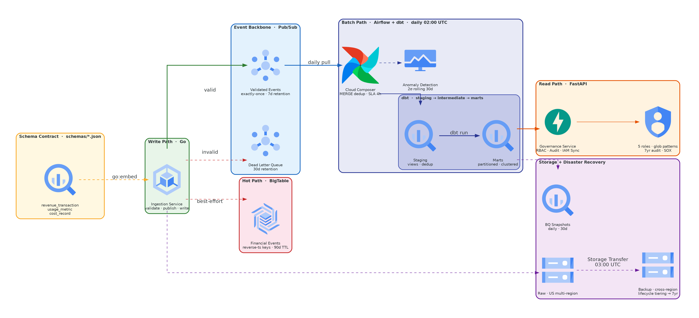
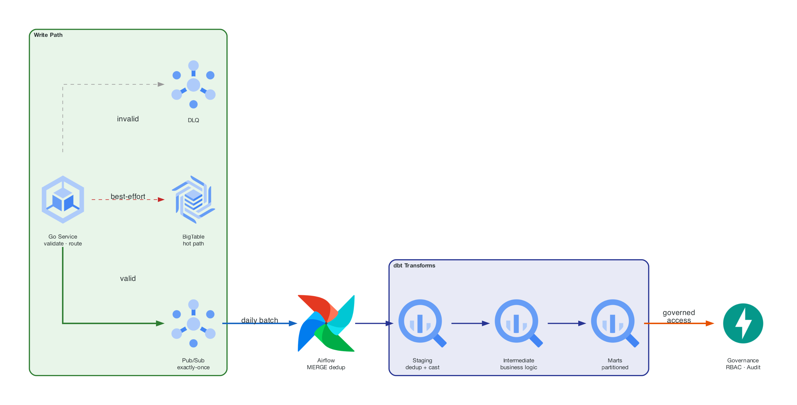
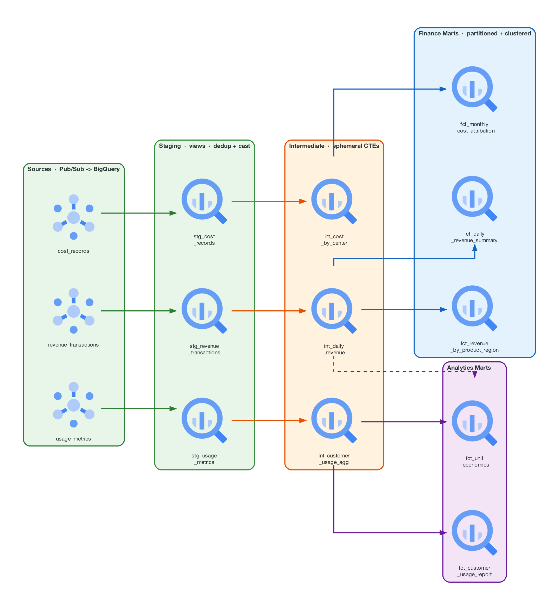

# GCP Financial Data Platform

[](https://github.com/damsolanke/gcp-financial-data-platform/actions/workflows/ci.yml)

A reference architecture for financial data infrastructure on GCP. Five integrated components — Go ingestion, Airflow orchestration, dbt transforms, Python governance, Terraform IaC — share one JSON Schema contract and one `fdp_<env>_<layer>` dataset naming scheme. Everything in CI runs without GCP credentials; the [wired-vs-scaffolded table](#what-is-wired-vs-scaffolded) says exactly which parts execute end to end and which are structure only.

## Architecture

<p align="center">
  
</p>

### Data Paths

| Path | Stack | What it does |
|------|-------|-------------|
| **Write** | Go, Pub/Sub, BigTable | Validates events against embedded JSON Schema, publishes the validated payload to Pub/Sub, writes it to BigTable (best-effort; Pub/Sub is the durable backbone). Invalid events go to the DLQ with their errors attached. |
| **Batch** | Airflow, dbt, BigQuery | Daily DAG: freshness check, MERGE into the `fdp_<env>_raw` landing tables (dedup by event ID), dbt run + test (`fdp_<env>_staging` views, `fdp_<env>_marts_*` tables), anomaly detection (2σ from a 30-day rolling average) into `fdp_<env>_audit.anomaly_alerts`. |
| **Read** | FastAPI, RBAC | Glob-pattern RBAC (`marts_finance.*`), every access check and grant/revoke recorded in an in-memory audit log, IAM sync generates Terraform HCL / binding dicts for BigQuery dataset bindings and validates them. |

### Event Lifecycle

How a single revenue event flows from API call to governed report:

<p align="center">
  
</p>

### dbt Lineage

<p align="center">
  
</p>

## What Ties It Together

One JSON Schema file defines each event type:

```
schemas/
├── revenue_transaction.json    ─── Go validates + contract-tests ─── Terraform raw tables ─── dbt sources/tests
├── usage_metric.json           ─── Generator reads enums
└── cost_record.json
```

| Consumer | How it uses the schema | Kept in sync by |
|----------|----------------------|-----------------|
| **Go ingestion** | `go:embed` compiles a copy into the binary; every published payload is exactly what passed validation | `internal/handler/contract_test.go` fails if the embedded copy drifts from `schemas/` or a published sample violates it |
| **Data generator** | Reads `schemas/` for enum values; its output (microsecond timestamps, `+00:00` offsets) is a fixture in the contract test | same test |
| **Terraform** | `fdp_<env>_raw` landing tables have one column per schema property plus `ingestion_timestamp` | by hand |
| **dbt** | Sources mirror the raw tables; staging tests mirror the constraints (`accepted_values`, `not_null`); `parse_event_timestamp` handles every timestamp shape the producers emit | by hand, plus dbt unit tests for the macro |

Pub/Sub has no topic schema: the topic carries three event types and one Avro schema cannot describe them — see [`terraform/modules/pubsub/README.md`](terraform/modules/pubsub/README.md). Change a field in `schemas/` and the Go contract test breaks first; Terraform and dbt need a coordinated edit.

## Performance

Measured on 2026-09-10 with `make bench` on a 4-vCPU CI-class container (linux/amd64, Go 1.24.7), single goroutine, no I/O:

```
goos: linux
goarch: amd64
pkg: github.com/damsolanke/gcp-financial-data-platform/ingestion-service/internal/validator
cpu: Intel(R) Xeon(R) Processor @ 2.80GHz
BenchmarkValidateRevenueTransaction-4   	   90021	     11574 ns/op	    3561 B/op	     115 allocs/op
```

About 86K JSON Schema validations per second on one core for a `revenue_transaction` event. Only validation is measured; publish and Bigtable latency depend on the network and are not benchmarked. The 10K events/sec figure in ARCHITECTURE.md is a design target, not a load-test result.

## Quick Start

```bash
git clone https://github.com/damsolanke/gcp-financial-data-platform.git
cd gcp-financial-data-platform
make up             # Start all services (emulators, Airflow, ingestion, governance)
make generate       # Generate 610K sample events over 90 days (100K revenue, 500K usage, 10K cost)
```

```bash
# Ingest a revenue event
curl -X POST localhost:8080/api/v1/events?type=revenue_transaction \
  -H "Content-Type: application/json" \
  -d '{"transaction_id":"550e8400-e29b-41d4-a716-446655440000","timestamp":"2025-01-15T10:30:00Z","amount_cents":1500,"currency":"USD","customer_id":"cust-12345","product_line":"api_usage","region":"us-east"}'

# Check access
curl localhost:8081/api/v1/access/check/analyst-001/marts_finance.fct_daily_revenue_summary
```

| Service | URL | Description |
|---------|-----|-------------|
| Ingestion | `localhost:8080` | Go event API (`POST /api/v1/events`, `GET /healthz`) |
| Governance | `localhost:8081` | FastAPI RBAC + audit (`GET /check/{user}/{dataset}`) |
| Airflow | `localhost:8082` | DAG UI (admin/admin) |
| Pub/Sub Emulator | `localhost:8085` | Local event streaming |
| BigTable Emulator | `localhost:8086` | Local hot-path store |

## Modules

### [Ingestion Service](ingestion-service/) — Go

The single write path. Receives events via HTTP, validates against embedded JSON Schemas, publishes the validated payload to Pub/Sub, writes it to BigTable under `{event_type}#{MaxInt64 - unix_ms}#{event_id}` with a conditional mutation (idempotent). Interface-driven (`EventPublisher`, `EventWriter`) for testability; the contract test validates every published sample against `schemas/`. Graceful shutdown drains HTTP connections, flushes Pub/Sub buffers, closes BigTable. Prometheus metrics (`internal/metrics/prometheus.go`): `ingestion_events_received_total`, `ingestion_events_validated_total`, `ingestion_events_failed_total`, `ingestion_validation_latency_seconds`, `ingestion_publish_latency_seconds`, `ingestion_bigtable_write_latency_seconds`.

### [Orchestration](orchestration/) — Airflow

Daily pipeline at 02:00 UTC with 4-hour SLA. Reads `GCP_PROJECT_ID`, `ENVIRONMENT` and `BQ_DATASET_*` from the environment Cloud Composer exports (project ID resolved inside tasks, never at parse time). Custom `BigQueryFreshnessOperator` skips (not fails) on stale data. `AnomalyDetectionOperator` computes 30-day rolling mean+stddev of total daily revenue and inserts >2σ deviations into `fdp_<env>_audit.anomaly_alerts` (schema shared with Terraform and `docs/data_model.md`, enforced by a test). Audit task runs with `trigger_rule=ALL_DONE` and logs the outcome regardless of upstream success/failure.

### [dbt Project](dbt_project/) — SQL

Staging views (dedup + `parse_event_timestamp`), ephemeral intermediate CTEs (business logic), partitioned+clustered mart tables (reporting), all in `fdp_<env>_<layer>` datasets. Window functions: DoD/WoW growth via `LAG`, 7-day rolling averages, MTD running totals. Macros: `parse_event_timestamp` (fractional seconds + offsets, with dbt unit tests), `cents_to_dollars`, `safe_divide`, `date_spine`. Seed data for currency rates, product lines, cost centers.

### [Governance](governance/) — Python/FastAPI

5 roles × 5 dataset patterns × 3 permission levels. `fnmatch` glob matching on logical layer names (`staging.*` matches `staging.stg_revenue_transactions`; the physical dataset is `fdp_<env>_staging`). Every access check and every grant/revoke is recorded in an in-memory audit log (the BigQuery sink is not wired). IAM sync generates Terraform HCL or binding dicts and validates them: no primitive roles, no `allUsers`, service accounts only. 110 tests; `ruff` rule set pinned in `ruff.toml`.

### [Infrastructure](terraform/) — Terraform

8 modules, each with pinned providers and `terraform validate` in CI. BigQuery: 6 `fdp_<env>_<layer>` datasets; raw landing tables mirror `schemas/`, audit tables include the shared `anomaly_alerts` schema. BigTable: SSD, GC policies (90d event data, 1 version metadata). Pub/Sub: exactly-once, 5 delivery attempts → DLQ, no topic schema (reason in the module README). GCS: lifecycle tiering (Standard → Nearline 30d → Coldline 90d → Archive 365d → Delete 7yr). IAM: 4 service accounts, Workload Identity bindings, zero exported keys. GKE: Autopilot, Workload-Identity KSAs, ClusterIP Services, `/healthz` probes, HPA 2-10 replicas, egress network policies, images from an Artifact Registry variable. DR: daily BQ snapshot transfers, cross-region GCS replication, RTO <45min / RPO <1hr targets.

## Design Decisions

| Decision | Why | Tradeoff |
|----------|-----|----------|
| **BigTable over Redis** for hot path | Durability, native GCP integration, auto-scaling, natural path to Spanner | Higher latency (~5ms vs ~1ms) |
| **Best-effort BigTable writes** | Pub/Sub is the durable backbone; BigTable is a hot-path optimization | Hot-path queries may briefly lag behind Pub/Sub |
| **dbt over raw SQL** | Testability, lineage, documentation-as-code, staging/intermediate/marts pattern | Additional build step, dbt-specific learning curve |
| **RBAC over ABAC** | Simpler to audit for SOX/ITGC compliance, easier to reason about | Less granular than attribute-based policies |
| **Cross-region GCS over multi-region** | Explicit replication control, integrity verification, compliance-friendly | Requires managing Storage Transfer job |
| **Cloud Composer over self-hosted Airflow** | Operational simplicity, managed upgrades, GCP-native IAM | Higher cost, less customization |
| **GKE Autopilot over Standard** | No node pool sizing, per-pod billing, built-in security hardening | Less control over node configuration |
| **Skip (not fail) on stale data** | Prevents cascading failures; stale data is informational, not a pipeline blocker | Silently stale results if alerting isn't watched |

## What Is Wired vs. Scaffolded

| Area | Status | Evidence |
|------|--------|----------|
| Ingestion: validate → Pub/Sub → BigTable, DLQ on failure | **Wired.** Unit + contract tests in CI; publisher/BigTable tests need emulators and skip without them | `ingestion-service/internal/handler`, `contract_test.go` |
| `/healthz` dependency checks | Static: always reports `ok` | `internal/handler/events.go` |
| Pub/Sub topic schema | Removed on purpose | `terraform/modules/pubsub/README.md` |
| Governance RBAC + audit API | **Wired**; user store and audit log are in-memory, no BigQuery sink | `governance/app` |
| IAM sync | Generates + validates bindings; nothing applies them; emits logical patterns as `dataset_id` | `governance/app/services/iam_sync.py` |
| DAG structure, retries, SLA, trigger rules | **Wired**; DagBag tests in CI | `orchestration/tests/test_financial_pipeline.py` |
| `load_to_staging` | MERGE into `fdp_<env>_raw` only; the Pub/Sub pull that fills `_temp_*` is not implemented | `orchestration/dags/financial_pipeline_daily.py` |
| `generate_financial_reports`, `update_audit_log` | Log only | same |
| Anomaly detection | **Wired** query + INSERT; schema shared with Terraform/docs and test-enforced | `orchestration/plugins/operators/anomaly_detection_operator.py`, `tests/test_anomaly_detection_operator.py` |
| dbt models, schema tests, unit tests | `dbt parse` in CI; `dbt run` / `dbt test` (including the macro unit tests) need BigQuery | `dbt_project/` |
| Terraform, 8 modules | `fmt` + `validate` with pinned providers in CI; never applied in CI | `terraform/` |
| Terraform mart table shells | Column set differs from the dbt models that replace them (follow-up) | `terraform/modules/bigquery/main.tf` |
| Kubernetes workloads | Validated only; Artifact Registry repo itself not provisioned | `terraform/modules/kubernetes` |
| Disaster recovery | Snapshot transfers + scheduler; the `dr-test-runner` Cloud Function is not in the repo | `terraform/modules/disaster_recovery` |
| Local stack | Pub/Sub + BigTable emulators, Airflow, both services; no BigQuery locally, so the DAG's BigQuery tasks and dbt do not run end to end | `docker-compose.yml`, `scripts/run_local.sh` |

## CI/CD

7 CI jobs run on every push and pull request — no GCP credentials and no emulators:

| Job | What it checks |
|-----|---------------|
| **Go** | `go vet` + `golangci-lint` + `go test -race` with coverage (includes the schema contract test) |
| **Python** | `ruff check` (pinned rule set) + `mypy` + `pytest` with coverage |
| **dbt** | `dbt deps` + `dbt parse` (offline, no BigQuery) |
| **Terraform** | `terraform fmt -check` + `terraform validate` (all 8 modules) + TFLint |
| **Docker** | Build both service images (no push) |
| **Airflow** | DAG import validation + dependency graph tests + the anomaly-schema guard |
| **gitleaks** | Secret scan over the full history |

CD is manual-trigger only (`workflow_dispatch`, environment `dev` or `prod`): builds and pushes both images, runs `terraform plan` for `terraform/environments/<env>` with the pushed image tag (no auto-apply; dev uses its local backend, prod its GCS backend from `TF_STATE_BUCKET`), then `dbt seed/run/test` against `fdp_<env>`. It also runs gitleaks.

## Testing

```bash
make test          # Go + governance + dbt parse/compile + DAG tests
make test-go       # Go: unit + contract tests, race detector, coverage
make test-python   # governance: pytest with coverage
make lint-python   # governance: ruff check + mypy
make bench         # Go: go test -bench=. -benchmem -run=^$ ./internal/validator/...
make lint          # All linters across all languages
make tf-validate   # terraform init -backend=false + validate for every module
```

## Project Structure

```
├── schemas/                     # THE CONTRACT — shared JSON Schemas
├── ingestion-service/           # Go write path
│   ├── cmd/server/              #   HTTP server + graceful shutdown
│   └── internal/                #   handler, validator, publisher, bigtable, metrics
├── orchestration/               # Airflow batch path
│   ├── dags/                    #   financial_pipeline_daily
│   └── plugins/operators/       #   freshness + anomaly detection operators
├── dbt_project/                 # SQL transform layer
│   └── models/                  #   staging → intermediate → marts
├── governance/                  # Python read path
│   └── app/                     #   routes, models, services (RBAC, audit, IAM sync)
├── terraform/                   # Infrastructure
│   ├── modules/                 #   8 modules (bigquery, bigtable, pubsub, gcs, iam, kubernetes, cloud_composer, disaster_recovery)
│   └── environments/            #   dev + prod
├── scripts/                     # Data generation + local dev setup
├── docs/                        # System design, data model, runbooks
├── .github/workflows/           # CI (7 jobs incl. gitleaks) + CD (manual, dev|prod)
├── docker-compose.yml           # Full local stack with emulators
└── Makefile                     # Single interface for everything
```

## Reliability Targets

Design targets, not measurements; nothing in this repository has been load-tested or run through a DR drill.

| Metric | Target | Mechanism in the repo |
|--------|--------|-----------------------|
| **Durability** | 99.99% | Pub/Sub retention (7d) + GCS cross-region transfer + daily BQ snapshot transfers |
| **RTO** | <45 min | Restore from BQ snapshots per `docs/runbooks/disaster_recovery.md` |
| **RPO** | <1 hr | Daily snapshots, GCS transfer at 03:00 UTC, Pub/Sub replay by subscription seek |
| **Batch SLA** | <4 hr | Airflow `sla_miss_callback` on the daily DAG |
| **Audit retention** | 7 years | Audit dataset has no table expiration; no delete role granted (no retention policy object yet) |

## License

Apache 2.0 — see [LICENSE](LICENSE).
